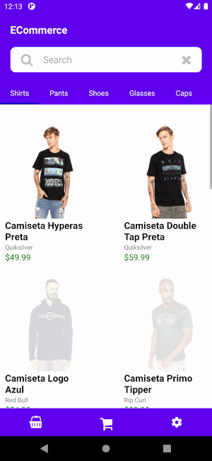

# Ecommerce

This is Ecommerce React Native Application Prototype.


<br>

# Demo
<p align="center">
    
</p>

<br>

# Dependencies
* [React-Native](https://reactnative.dev/)  ~V 0.63.0
* [Redux](https://redux.js.org/) and [React-Redux](https://react-redux.js.org/) for State Management.
* [Styled-Components](https://styled-components.com/) for styling the components.
* [Json-Server](https://www.npmjs.com/package/json-server) for Fake beckend API.

<br>

# Getting started

Start by cloning repository and installing dependencies using yarn

```shell
git clone
cd ecommerce
yarn add
or
npm install --save
```

__Link assets__

```shell
npx react-native link
```

For iOS, install Cocoapods and run command

```shell
cd ios && pod install
```


<br>

## Run Server

If Json Sever is not installed. Type following command

```shell
npm i json-server
```

If Json Server is already installed.

```shell
json-server --watch server.json
```
<br>

## Run React Application
    cd ecommerse
    npm run android && npm start
